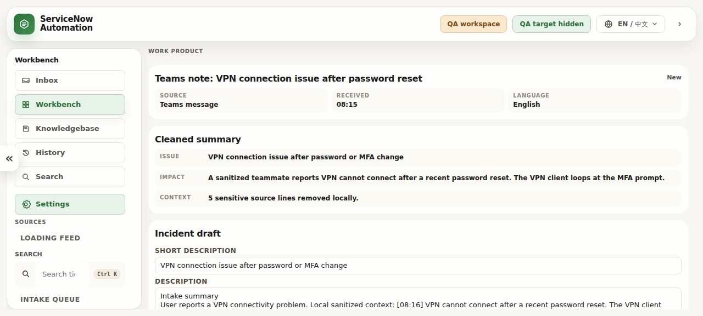
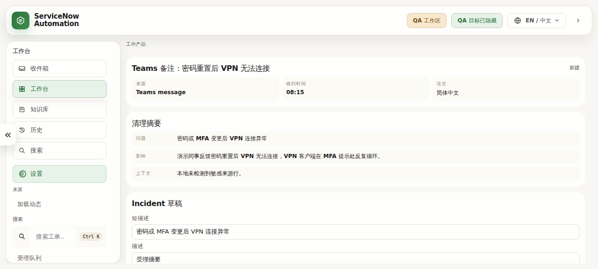

# ServiceNow Automation Workbench

> **English / 中文**: This README is written in both languages because GitHub README and Release pages do **not** support a native language-toggle button. The project itself includes an in-app language selector.
>
> **语言说明**：GitHub 的 README 和 Release 页面原生不支持真正的语言切换按钮，因此这里采用中英双语内容；软件界面内已提供语言选择。





## English

### What it is

**ServiceNow Automation Workbench** is a local-first, human-in-the-loop desktop workbench for service-desk operators. It turns sanitized support context into a structured Incident draft, local KB recommendations, a guided review path, and a safe browser-assisted workflow.

It is designed for this operating rule:

> AI can draft and help fill allowed text fields. A human reviews, decides, and submits in ServiceNow.

### Download

Public release:

- Repository: <https://github.com/alanxiaofeifei/servicenow-automation>
- Release v0.1.0: <https://github.com/alanxiaofeifei/servicenow-automation/releases/tag/v0.1.0>
- Windows ZIP: <https://github.com/alanxiaofeifei/servicenow-automation/releases/download/v0.1.0/servicenow-automation-windows-v0.1.0-public-20260607.zip>
- SHA256: `e0fdbbd69060e87ebbda96ed95c9bfbf4d40807e53f3b861777e78ad6f6fe692`

### Basic usage

1. Download the Windows ZIP from the release page.
2. Extract the ZIP to a local Windows folder.
3. Read `START-HERE-WINDOWS.txt` first.
4. Double-click `ServiceNow Automation.exe`.
5. Use the local demo queue or manually pasted sanitized text to review the workbench flow:
   - selected source detail
   - cleaned summary
   - Incident draft
   - guided review path
   - local KB recommendations
   - monthly Excel fill queue placeholder
6. Do **not** use real customer data or real ServiceNow production content while testing this preview.

### Current v0.1.0 capabilities

- Local demo intake queue and manual paste workflow.
- Structured Incident draft with short description, description, and work notes.
- Local-only KB recommendation cards with evidence and suggested support group.
- Guided review path for explaining the service-desk workflow.
- Local monthly Excel fill queue placeholder for post-ticket bookkeeping.
- Bilingual app UI support, including English and Chinese modes.
- Windows ZIP package for manual desktop testing.
- Safety-first browser assistance boundaries: no automated Save, Submit, Update, Resolve, or Close.

### Current testing boundary

This release is a **public test preview**, not a final production automation product.

Allowed in this preview:

- local demo data
- manually pasted sanitized text
- local UI review
- package launch testing
- safe workflow demonstration

Not allowed / not implemented as production behavior:

- real ServiceNow login automation
- real ticket submission
- Save / Submit / Update / Resolve / Close automation
- Microsoft Graph or Excel Web writeback
- real Teams / Outlook / phone-system ingestion
- real customer or production ticket content

### Development vision

The long-term goal is a safe Service Desk Workflow Cockpit:

- ingest approved support context from controlled sources
- normalize user reports into structured ticket drafts
- recommend local KB steps and support groups
- guide the operator through review, evidence, and handoff
- assist with allowed form fields while keeping final ITSM actions under human control
- produce reusable SOPs, KB updates, and monthly reporting cues

The final product direction is not a “ticket bot.” It is a controlled operator workbench where automation supports the human agent without bypassing ITSM governance.

### Development

```bash
pnpm install
pnpm build
pnpm typecheck
pnpm test
pnpm privacy:scan
```

Windows package build:

```bash
pnpm release:windows:rc
```

### Safety and privacy

Do not commit or paste real customer data, real ticket IDs, real browser sessions, cookies, traces, HAR files, screenshots from private systems, credentials, or production ServiceNow URLs.

---

## 中文

### 项目简介

**ServiceNow Automation Workbench** 是一个本地优先、人工审核优先的桌面工作台，面向 Service Desk / IT Support 场景。它可以把经过脱敏的支持上下文整理成结构化 Incident 草稿、本地 KB 推荐、引导式审核路径，以及安全边界内的浏览器辅助流程。

核心原则是：

> AI 可以草拟内容，并辅助填写允许的文本字段；最终审核、判断和提交仍由人工完成。

### 下载

公开发布版本：

- GitHub 仓库：<https://github.com/alanxiaofeifei/servicenow-automation>
- v0.1.0 Release：<https://github.com/alanxiaofeifei/servicenow-automation/releases/tag/v0.1.0>
- Windows ZIP：<https://github.com/alanxiaofeifei/servicenow-automation/releases/download/v0.1.0/servicenow-automation-windows-v0.1.0-public-20260607.zip>
- SHA256：`e0fdbbd69060e87ebbda96ed95c9bfbf4d40807e53f3b861777e78ad6f6fe692`

### 基础用法

1. 从 Release 页面下载 Windows ZIP。
2. 解压到本地 Windows 文件夹。
3. 先阅读 `START-HERE-WINDOWS.txt`。
4. 双击 `ServiceNow Automation.exe`。
5. 使用本地 demo 队列或手动粘贴的脱敏文本，查看工作台流程：
   - 选中的来源详情
   - 自动整理摘要
   - Incident 草稿
   - 引导式审核路径
   - 本地 KB 推荐
   - 月度 Excel 填写队列占位流程
6. 测试期间不要使用真实客户数据或真实生产 ServiceNow 内容。

### 当前 v0.1.0 功能

- 本地 demo intake queue 和手动粘贴流程。
- Incident 草稿：短描述、描述、Work notes。
- 本地 KB 推荐卡片：证据、置信度、推荐支持组。
- 引导式审核路径：帮助操作者理解流程。
- 月度 Excel 填写队列占位：用于表达“工单完成后是否进入月度记录”的流程，不执行真实写入。
- 中英文界面支持。
- Windows ZIP 桌面测试包。
- 安全浏览器辅助边界：不会自动 Save、Submit、Update、Resolve、Close。

### 当前测试边界

这个版本是 **公开测试预览版**，不是最终生产自动化产品。

当前允许：

- 本地 demo 数据
- 手动粘贴的脱敏文本
- 本地 UI 检查
- Windows 包启动测试
- 安全工作流演示

当前不做 / 不作为生产能力：

- 真实 ServiceNow 登录自动化
- 真实工单提交
- Save / Submit / Update / Resolve / Close 自动化
- Microsoft Graph 或 Excel Web 写入
- 真实 Teams / Outlook / 电话系统接入
- 真实客户或生产工单内容处理

### 最终开发愿景

长期目标是一个安全的 **Service Desk Workflow Cockpit**：

- 从经过授权的来源获取支持上下文
- 把用户问题整理成结构化工单草稿
- 推荐本地 KB 步骤和支持组
- 引导操作者完成审核、证据检查和交接
- 在安全边界内辅助填写允许的字段
- 保持最终 ITSM 操作由人工控制
- 把重复问题沉淀为 SOP、KB 更新和月度记录提示

这个项目的目标不是“自动提交工单机器人”，而是一个受控的人工审核工作台：让自动化提高效率，但不绕过 ITSM 治理。

### 本地开发

```bash
pnpm install
pnpm build
pnpm typecheck
pnpm test
pnpm privacy:scan
```

Windows 打包：

```bash
pnpm release:windows:rc
```

### 安全与隐私

不要提交或粘贴真实客户数据、真实工单号、真实浏览器会话、cookies、traces、HAR 文件、私有系统截图、凭据或生产 ServiceNow URL。
